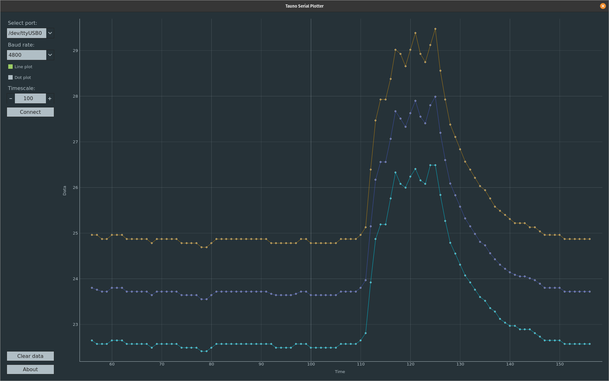

# Lämmämõõdusk

## Description

A device that measures the ambient temperature in the environment in which it is located. And displays it on the screen.

## Artistic description

Plant-like structures. Display like blossom. Bottom woodblock aged with brushing with a wire brush and oxidation solution (steel wool + vingar).

### Animations
When the number to display changes it plays short animation.

## Technical description

The first goal was to test an easier way to connect 7-segs and shift registers.

Main CPU, Arduino pro mini, uses thermistor to calculate temperature. Uses two different algorithms for this: Steinhart-hart equation and Beta model equation.

The display consists of two seven-segment displays. Drived by two 74HC595 shift registers. Which is connected to the seven-segment displays in a non-traditional way.This makes the construction easier.

IDE: [PlatformIO](https://platformio.org/)

The [code](src/main.cpp) is in the src directory.

## Parts list

| no  | Description                 | pcs  |
| :--:| :----                       | ---: |
| 1   | Arduino pro mini Mega328p 5V| 1    |
| 2   | Shift Register SN74HC595N   | 2    |
| 3   | 7-segment 5611BH / 5161BS   | 2    |
| 4   | Resistor 120                | 16   |
| 5   | CH340E USB to TTL BTE17-06  | 1    |
| 6   | Thermistor 10k              | 1    |
| 7   | Resistor 10K                | 1    |

## Readin data

The simplest way to read serial data is to use Miniterm

Data viewed on my [Serial Plotter](https://github.com/taunoe/tauno-serial-plotter).

Also, I have made two Python scripts. [read.py](py/read.py) and simple GUI app [gui.py](py/gui.py). What display average temperature.

___

Copyright 2021 Tauno Erik https://taunoerik.art
